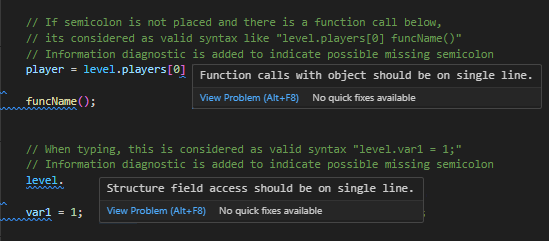
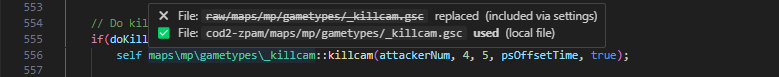
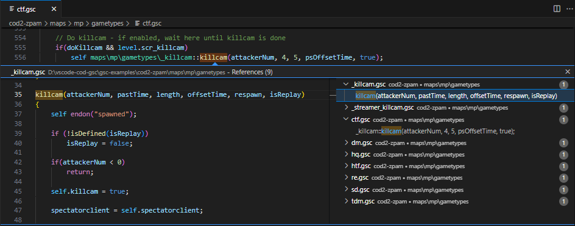
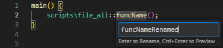
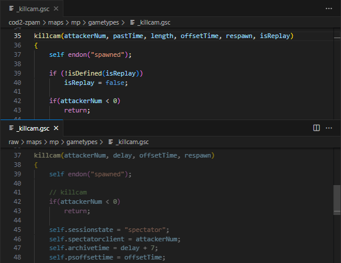
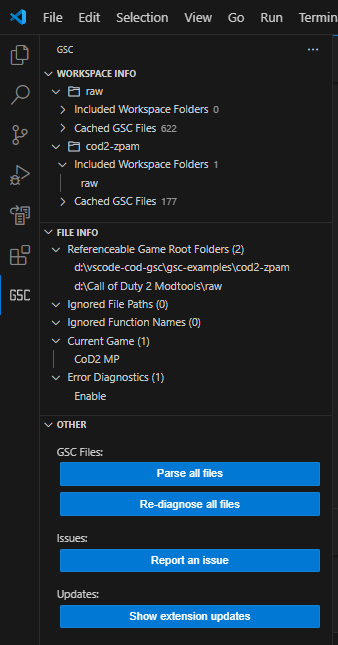

# CoD GSC extension for VS Code

This extension adds language support for the GSC scripts used in Call of Duty games.

⚠️ This extension is still under development and is not fully finished. Check the list of the available features in [List of features](#list-of-features).

## Supported games

<table>
    <tr>
        <td width="100px">Game</td>
        <td width="50px">Code</td>
        <td width="150px">Modification</td>
        <td width="150px">Status</td>
        <td>Not working yet</td>
    </tr>
    <tr>
        <td>CoD1</td>
        <td>IW1</td>
        <td>original</td>
        <td>✅ Supported</td>
        <td></td>
    </tr>
    <tr>
        <td>CoD2</td>
        <td>IW2</td>
        <td>original</td>
        <td>✅ Supported</td>
        <td></td>
    </tr>
    <tr>
        <td>CoD4</td>
        <td>IW3</td>
        <td>original</td>
        <td>✅ Supported</td>
        <td></td>
    </tr>
    <tr>
        <td rowspan="2">CoD5</td>
        <td rowspan="2">T4</td>
        <td>original</td>
        <td>✅ Supported</td>
        <td></td>
    </tr>
    <tr>
        <td>Plutonium T4</td>
        <td>❔</td>
        <td></td>
    </tr>
    <tr>
        <td rowspan="2">MW2</td>
        <td rowspan="2">IW4</td>
        <td>original</td>
        <td>❗ Tested, errors</td>
        <td>childthread, call</td>
    </tr>
    <tr>
        <td>Alterware IW4x</td>
        <td>❔</td>
        <td></td>
    </tr>
    <tr>
        <td rowspan="2">BO1</td>
        <td rowspan="2">T5</td>
        <td>original</td>
        <td>✅ Supported</td>
        <td></td>
    </tr>
    <tr>
        <td>Plutonium T5</td>
        <td>❔</td>
        <td></td>
    </tr>
    <tr>
        <td rowspan="3">MW3</td>
        <td rowspan="3">IW5</td>
        <td>original</td>
        <td>❗ Tested, errors</td>
        <td>childthread, call</td>
    </tr>
    <tr>
        <td>Plutonium IW5</td>
        <td>❔</td>
        <td></td>
    </tr>
    <tr>
        <td>Alterware IW5-Mod</td>
        <td>❔</td>
        <td></td>
    </tr>
    <tr>
        <td rowspan="2">BO2</td>
        <td rowspan="2">T6</td>
        <td>original</td>
        <td>❗ Tested, errors</td>
        <td>#insert, #define, param default value, autoexec, const, %xxx::yyy, /@ comments @/</td>
    </tr>
    <tr>
        <td>Plutonium T6</td>
        <td>❗ Tested, errors</td>
        <td>order of file references</td>
    </tr>
    <tr>
        <td rowspan="2">Ghosts</td>
        <td rowspan="2">IW6</td>
        <td>original</td>
        <td>❔</td>
        <td></td>
    </tr>
    <tr>
        <td>Alterware IW6-Mod</td>
        <td>❔</td>
        <td></td>
    </tr>
    <tr>
        <td rowspan="2">AW</td>
        <td rowspan="2">S1</td>
        <td>original</td>
        <td>❗ Tested, errors</td>
        <td>childthread, call</td>
    </tr>
    <tr>
        <td>Alterware S1-Mod</td>
        <td>❔</td>
        <td></td>
    </tr>
    <tr>
        <td>BO3</td>
        <td>T7</td>
        <td>original</td>
        <td>🚫 Not supported</td>
        <td>#using, #namespace, function, .gscc, .csc, .cscc</td>
    </tr>
    <tr>
        <td rowspan="2">IW</td>
        <td rowspan="2">IW7</td>
        <td>original</td>
        <td>❔</td>
        <td></td>
    </tr>
    <tr>
        <td>Aurora IW7-mod</td>
        <td>❔</td>
        <td></td>
    </tr>
    <tr>
        <td rowspan="2">CoD4:MWR</td>
        <td rowspan="2">H1</td>
        <td>original</td>
        <td>❔</td>
        <td></td>
    </tr>
    <tr>
        <td>Aurora H1-mod</td>
        <td>❗ Tested, errors</td>
        <td>param default value, call, childthread</td>
    </tr>
    <tr>
        <td>WWII</td>
        <td>S2</td>
        <td>original</td>
        <td>❔</td>
        <td></td>
    </tr>
    <tr>
        <td>BO4</td>
        <td>T8</td>
        <td>original</td>
        <td>❔</td>
        <td></td>
    </tr>
    <tr>
        <td>MW</td>
        <td>IW8</td>
        <td>original</td>
        <td>❔</td>
        <td></td>
    </tr>
    <tr>
        <td>BOCW</td>
        <td>T9</td>
        <td>original</td>
        <td>❔</td>
        <td></td>
    </tr>
    <tr>
        <td>Vanguard</td>
        <td>S3</td>
        <td>original</td>
        <td>❔</td>
        <td></td>
    </tr>
    <tr>
        <td>MWII</td>
        <td>IW9</td>
        <td>original</td>
        <td>❔</td>
        <td></td>
    </tr>
    <tr>
        <td>MWIII</td>
        <td>S4</td>
        <td>original</td>
        <td>❔</td>
        <td></td>
    </tr>
    <tr>
        <td>BO6</td>
        <td>T10</td>
        <td>original</td>
        <td>❔</td>
        <td></td>
    </tr>
</table>

## Change log

[View changes](CHANGELOG.md)

## Features

### Syntax highlighting

  

### Completion items
#### Completion items - local functions

#### Completion items - included functions via #include

#### Completion items - with CoD2 MP functions

#### Completion items - variables

#### Completion items - variables with recognized variable type

#### Completion items - variables from included workspace folders

  

### Diagnostics

#### Diagnostics - error messages

#### Diagnostics - invalid file for #include

#### Diagnostics - possible missing semicolon indication

  

### Functions

#### Function - go to definition

#### Function - hover info

#### Function - hover info over CoD2 MP function spawn:

#### Function - hover over path

#### Function - references

#### Function - rename

  

### Workspace folders
VSCode multi-root workspace can be used to "join" your mod folders as they get loaded into the game.

The order of how files are being searched is now determined by how the workspace folder appears in explorer tab. 
The last folder is searched first.

It can simulate your .IWD files - their file name determines which files gets loaded first in the game.

For example, this is typical setup:
- raw
- mod1
- mappack

From game perspective, it could represents these files:
- iw_00.iwd - iw15.iwd (original game files for CoD2)
- z_mod1.iwd
- zzz_mappack.iwd

The alphabetical order of .IWD is important to correctly replace original files.
The order of the workspace folders must be the same!

  

### Code actions
#### Code actions - include folder for file references

#### Code actions - ignore missing files

  

### GSC Files

#### Visualization of replaced (unreachable) files.

When GSC file is replaced by another GSC file in multi-root workspace because of the same game path, the code in text editor is shown as semi-transparent (unreachable code) 
Example:

  

### Other

#### Status bar
Allows quickly change the targeted game or open settings.

#### Side panel
GSC side panel with "Workspace", "File" and "Other" views.
It shows information about workspace setup, parsed GSC files and available commands to run.
In future version it will allow to change settings more interactively.

## List of features
- GSC file parser
  - Syntax parser
    - Comments (`/*...*/`, `//...`)
    - Developer blocks (`/# ... #/`)
    - Preprocessor (`#include`, `#using_animtree`, `#animtree`)
    - Keywords (`return`, `if`, `else`, `for`, `foreach`, `while`, `do-while`, `switch`, `continue`, `break`, `case`, `default`, `thread`, `wait`, `waittillframeend`, `waittill`, `waittillmatch`, `endon`, `notify`, `breakpoint`)
    - Operators (`=`, `+=`, `-=`, `*=`, `/=`, `%=`, `|=`, `&=`, `^=`, `++`, `--`, `+`, `-`, `*`, `/`, `%`, `|`, `&`, `^`, `<<`, `>>`, `==`, `!=`, `<`, `>`, `<=`, `>=`, `&&`, `||`, `!`, `~`)
    - Strings (`"default"`, `&"STRING_LOCALIZED"`, `#"sv_cvar_string"`)
    - Ternary conditional operators (`true ? "yes" : "no"`)
    - Anim string (`%xanim_file_name`)
    - Path (eg. `maps\mp\gametypes\sd`)
  - Detection of explicitly typed types of variables (string, localized string, cvar string, vector, integer, float, structure, array, function, entity, bool, xanim)
- Completion item provider (auto-suggestion)
    - Variables (local to function, global `level` and `game`)
    - Constants
    - Keywords 
    - File path
    - Function definitions
- Diagnostics (errors and warnings)
  - Syntax error
    - Unexpected tokens
    - Missing semicolons
  - Extra semicolons
  - Invalid function parameters
  - Missing files
  - Invalid numbers of function parameters
- Semantics token provider 
  - Proper colorization of tokens
- Definition and Reference provider
  - Local functions (`funcName()`)
  - External functions (`maps\mp\gametypes\file::funcName()`)
  - Included functions (via `#include`)
- Hover provider
  - Function info
  - Path info
- Code action provider
  - Adding missing files into ignored list
  - Adding undefined functions into ignored list
- Rename provider
  - Function rename

  

## TODO list
### Priority
- Add custom global include list of GSC function
- Support for default function parameter value - supported in newer COD games
- Support for 'chilthread' and 'call' keywords - supported in newer COD games
- Improve auto-suggestion for files
- When renaming GSC file, ask for reference update in other GSC files
### Non priority
- Code action - implement unknown function
- Add .csc files (client side scripts)
- Parser for .menu files
- Integrate list of built-in functions for CoD4
- Improve detection of variable types - now it's detected only by explicitly assigned constant value
- Show available string constants for `notify` `waittill` `waittillmatch` `endon` in completion item provider
- Check for unreachable code
- Implement "Go to definition" for variables
- Implement some kind of JSDoc comments to improve function and variable description
- Implement rename variable functionality
- Detection of undefined variables

## Install
This extension is available through Visual Studio Marketplace.

## Support
Please test this extension in vscode on your GSC files and report bugs / suggestions on the github page or on discord [KILLTUBE #vscode-cod-gsc](https://discord.gg/5WUpcMqUG7)

