# CoD GSC extension for VS Code

This extension adds language support for the GSC scripts used in Call of Duty (CoD1, CoD2, CoD3, CoD4, CoD5:WaW, CoD6:MW2, COD7:BO1).

This extension is still under development and is not fully finished. Check the list of the available features in [List of features](#list-of-features).

## Supported games

| Game     | Status  | Tested with    |
|----------|---------|----------------|
| CoD1     | ✅ Tested     | raw files     |
| CoD2     | ✅ Tested         | raw files zPAM 3.33 mod - https://github.com/eyza-cod2/zpam3    |
| CoD4     | ✅ Tested         | raw files Promod 2.20 mod - https://github.com/promod/promod4 OpenWarfare mod - https://github.com/cod4mw/openwarfare    |
| CoD5     | ❌ Not tested     | -    |
| CoD6:MW2 | ❌ Not tested     | -    |
| CoD7:BO1 | ✅ Tested         |  Redemption mod - https://github.com/roachnacs/redemption-bo1-gsc Reimagined zombies mod - https://github.com/Jbleezy/BO1-Reimagined   |
| Other    | 🚫 Not supported     |     |

Games released later will not be supported because the GSC syntax changed significantly since then.

## Features

Syntax highlighting

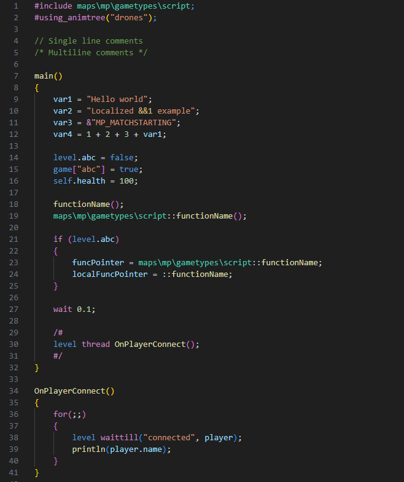

Completion items (local functions)

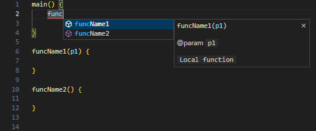

Completion items (included functions)

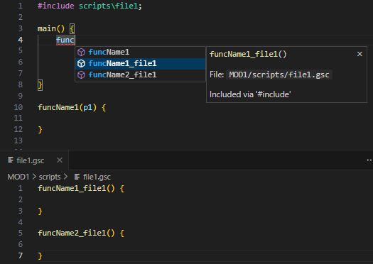

Completion items (with CoD2 MP functions)

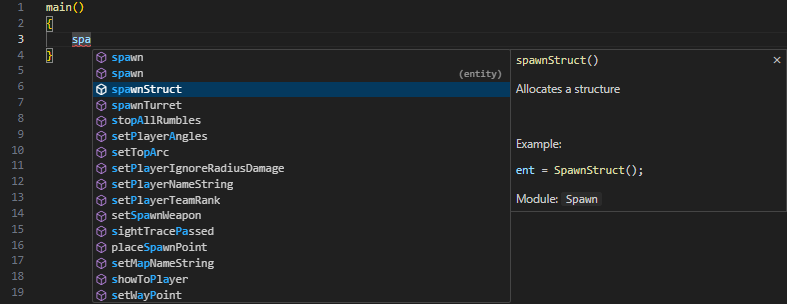

Completion items (variables)

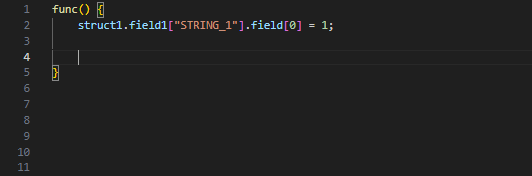

Completion items (variables with recognized variable type)

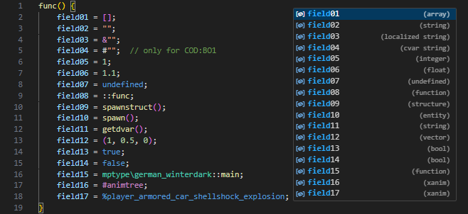

Completion items (variables from included workspace folders)

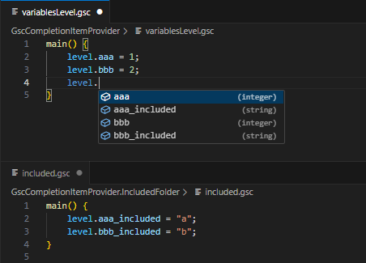

Diagnostics

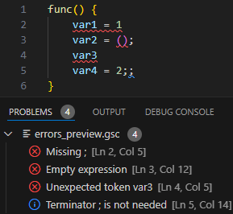

Diagnostics - invalid file for #include

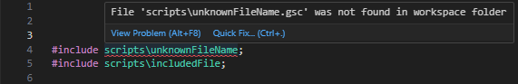

Function definition

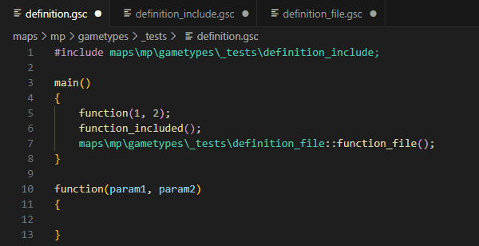

Function hover info

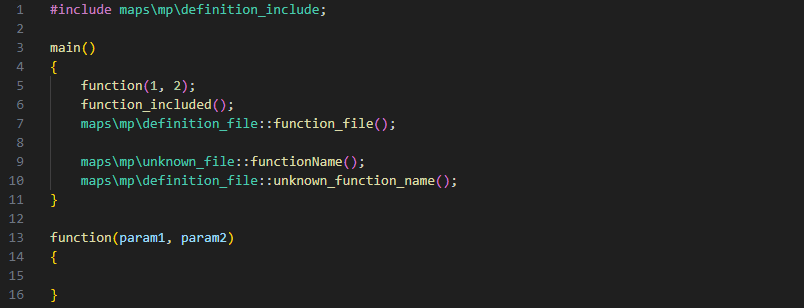

Function hover info over CoD2 MP function spawn:

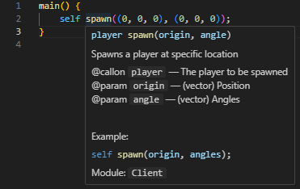

Code actions (include folder for file references)

Code actions (ignore missing files)

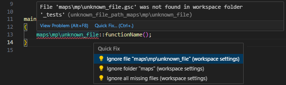

Workspace folders

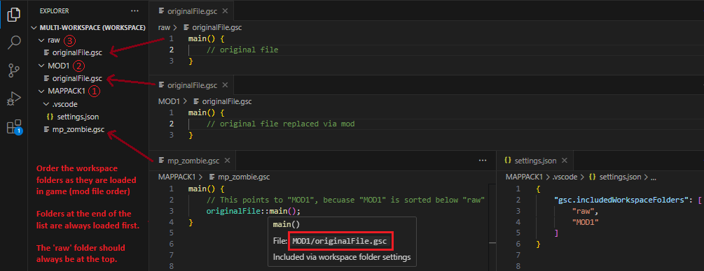

Status bar

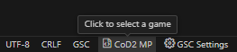

## List of features
- GSC file parser
  - Syntax parser
    - Comments (`/*...*/`, `//...`)
    - Developer blocks (`/# ... #/`)
    - Preprocessor (`#include`, `#using_animtree`, `#animtree`)
    - Keywords (`return`, `if`, `else`, `for`, `while`, `switch`, `continue`, `break`, `case`, `default`, `thread`, `wait`, `waittillframeend`, `waittill`, `waittillmatch`, `endon`, `notify`, `breakpoint`)
    - Operators (`=`, `+=`, `-=`, `*=`, `/=`, `%=`, `|=`, `&=`, `^=`, `++`, `--`, `+`, `-`, `*`, `/`, `%`, `|`, `&`, `^`, `<<`, `>>`, `==`, `!=`, `<`, `>`, `<=`, `>=`, `&&`, `||`, `!`, `~`)
    - Strings (`"default"`, `&"STRING_LOCALIZED"`, `#"sv_cvar_string"`)
    - Anim string (`%xanim_file_name`)
    - Path (eg. `maps\mp\gametypes\sd`)
  - Detection of explicitly typed types of variables (string, localized string, cvar string, vector, integer, float, structure, array, function, entity, bool, xanim)
- Completion item provider (auto-suggestion)
    - Variables (local to function, global `level` and `game`)
    - Constants
    - Keywords 
    - File path
    - Function definitions
- Diagnostics (errors and warnings)
  - Syntax error
    - Unexpected tokens
    - Missing semicolons
  - Extra semicolons
  - Invalid function parameters
  - Missing files
- Semantics token provider 
  - Proper colorization of tokens
- Definition provider
  - Local functions (`funcName()`)
  - External functions (`maps\mp\gametypes\file::funcName()`)
  - Included functions (via `#include`)
- Hover provider
  - Function info
- Code action provider
  - Adding missing files into ignored list
  - Adding undefined functions into ignored list

## TODO
- Parser for .menu files
- Integrate list of built-in functions for CoD4
- Improve detection of variable types - now it's detected only by explicitly assigned constant value
- Show available function names in completion item provider
- Show available string constants for `notify` `waittill` `waittillmatch` `endon` in completion item provider
- Check for unreachable code
- Implement "Go to definition" for variables
- Implement some kind of JSDoc comments to improve function and variable description
- Implement rename function / variable functionality
- Detection of undefined variables

## Install
This extension is available through Visual Studio Marketplace.

## Support
Please test this extension in vscode on your GSC files and report bugs / suggestions on the github page or on discord [KILLTUBE #vscode-cod-gsc](https://discord.gg/5WUpcMqUG7)

